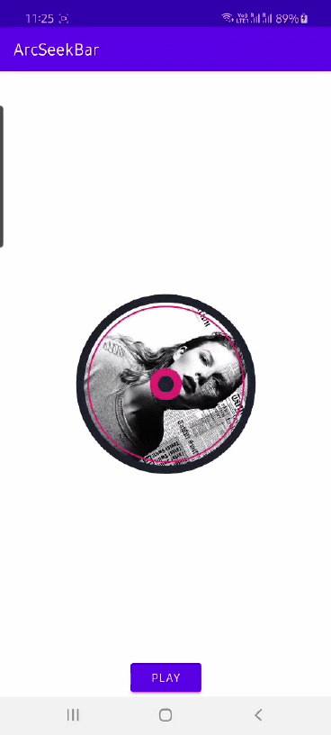

# music-cover-view
A rotating disc view with album art for your music player applications

## Setup

Import the lib module into your project

## Usage

```
 <com.andruid.magic.musiccover.MusicCoverView
     android:id="@+id/cover"
     android:layout_width="0dp"
     android:layout_height="0dp"
     android:src="@drawable/album"
     app:layout_constraintBottom_toBottomOf="parent"
     app:layout_constraintDimensionRatio="1"
     app:layout_constraintHeight_percent="0.3"
     app:layout_constraintLeft_toLeftOf="parent"
     app:layout_constraintRight_toRightOf="parent"
     app:layout_constraintTop_toTopOf="parent"
     app:ringColor="#E32A76"
     app:ringWidth="2dp"
     app:strokeColor="#1D1F2E"
     app:strokeWidth="10dp" />
 ```
 
 ## Attributes
 
 - ```app:ringColor``` - color of the ring near the outer stroke and inner ring
 - ```app:ringWidth``` - width of the ring near the outer stroke
 - ```app:strokeColor``` - color of the outer stroke and inner solid center
 - ```app:strokeWidth``` - width of the outer stroke and inner solid center
 
 ## Methods
 
 - ```isPlaying()``` - returns boolean for whether the disc is animating or not
 - ```play()``` - start/resume playing the rotate animation
 - ```pause()``` - pause playing the rotate animation
 
 
